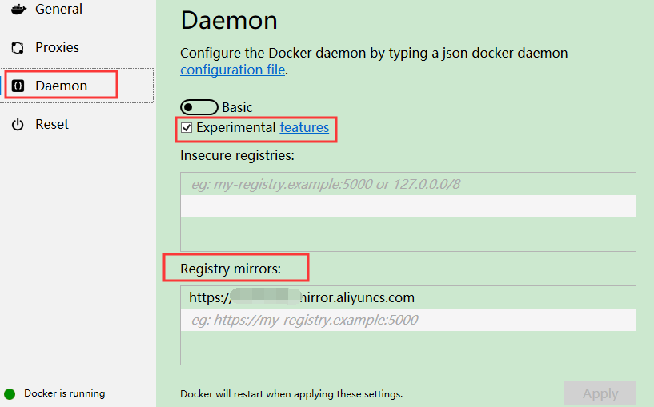
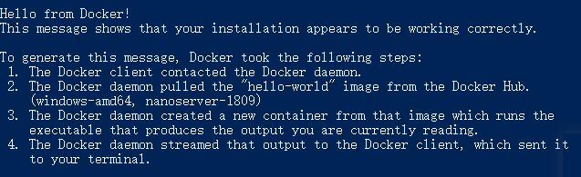
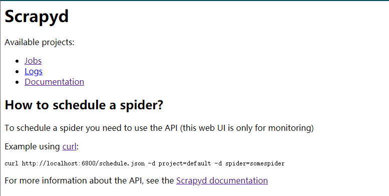
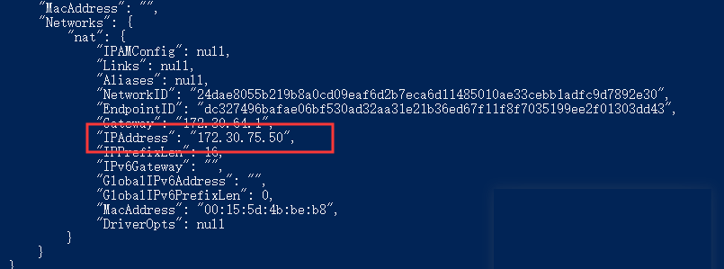
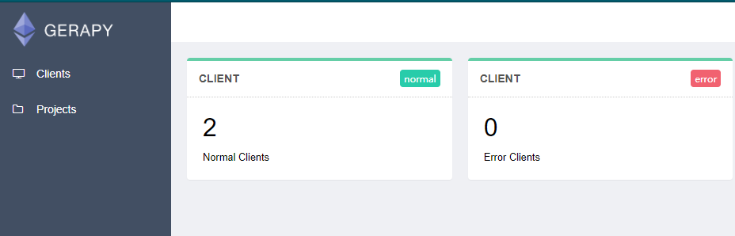
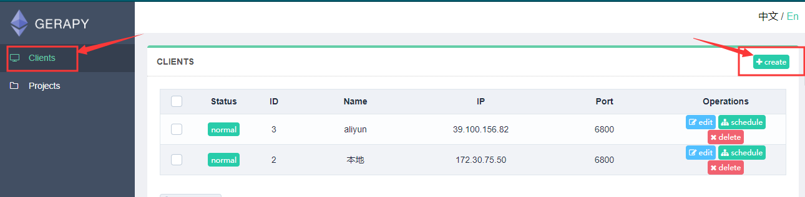
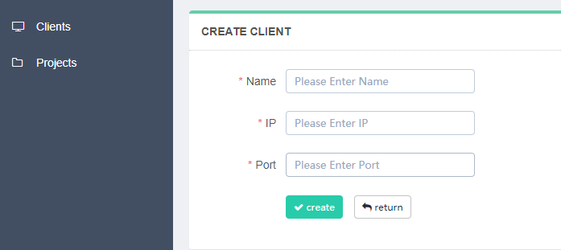
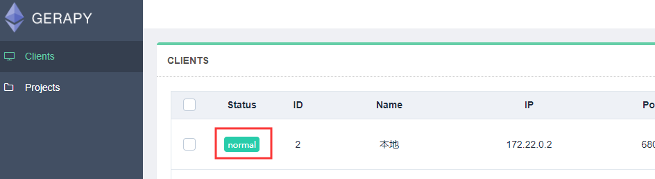
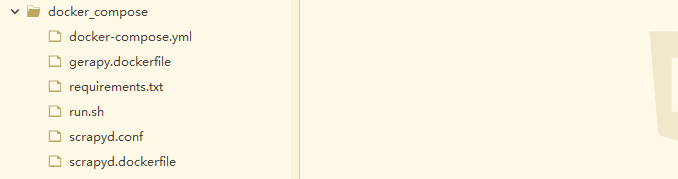
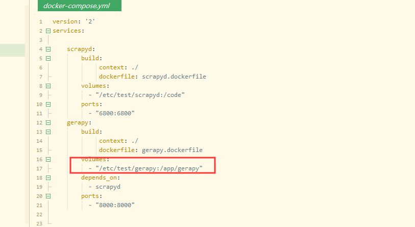

# 引用仓库germey/scrapy:latest 与 thsheep/gerapy:master
## docker下载路径 
 [docker下载](https://www.docker.com/products/docker-desktop)

## windows容器安装
1. 点击下载，会跳转到教程页，根据个人情况适当忽略
2. 双击安装，windows勾选构建windows容器（既第二个复选框）
Windows构建linux容器需要系统支持heyp-V虚拟机（或windows10专业版以上）
3. 安装完成后，运行docker，并输入账号
4. 配置docker 勾选settings > daemon > Experimental 在 settings > daemon
\> registry mirrors 添加阿里云镜像加速
怕麻烦：你就可以用这个：https://8or0wskc.mirror.aliyuncs.com

# docker使用
1. 配置完成后 首先运行docker run hello-world 正常则会输出以下消息：

# 本地环境运行scrapyd与gerapy分开时
## 首先运行scrapyd：
获取镜像: 
docker pull germey/scrapy
启动:（注意：绝对路径非c盘更好）
docker run -d --name=scrapyd --restart=always -v {绝对路径}:/code -p 6800:6800 germey/scrapyd
如：
docker run -d --name=scrapyd --restart=always -v F:\Python\scrapyd:/code -p 6800:6800 germey/scrapyd

启动的成功后，浏览器打开[scrapyd](http://127.0.0.1:6800)就可以访问到scrapyd 这是gerapy的运行基础

然后查看scrapyd的本地运行的id：docker ps 
利用CONTAINER ID查看主机分配的ip：docker inspect [CONTAINER ID]

记录这个ip

## 运行gerapy
获取镜像：
Docker pull thsheep/gerapy:master
启动：（注意：绝对路径非c盘更好）
docker run -d --name=gerapy --restart=always -v {绝对路径} -p 8000:8000 thsheep/gerapy:master
如
docker run -d --name=gerapy --restart=always -v F:\Python\gerapy:/app/gerapy -p 8000:8000 thsheep/gerapy:master
启动的成功后，浏览器打开[gerpay](http://127.0.0.1:8000)就可以访问到gerapy的首页 

连接主机或远程服务器：点击左侧 clients 到如下界面，然后点击右上角 create：

此时开始创建连接：

分别输入名称（自定义），IP地址（本地连接填上一步记录的IP），端口(一般是6800) 点击create
出现下图，就表示可以使用了，到此docker下的使用结束了，其余操作与本地开发环境操作一致

# scrapy与gerapy集成
Windows下运行这个命令
Docker-compose up
需要用的文件如下：

其中docker-compose.yml修改这项，更方便使用

将/etc/test/gerapy 换成你电脑上的绝对地址，如：F:\dome\test （注意：绝对路径非c盘更好）